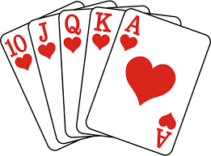

# PokerHighHandSimulator

## Problem Overview
Poker rooms use [High Hand (HH) promotions](https://www.pokernews.com/strategy/casino-poker-for-beginners-high-hand-bonus-bad-beat-jackpot-21976.htm) to attract [No Limit Hold 'Em (NLH)](https://en.wikipedia.org/wiki/Texas_hold_%27em) and [Pot Limit Omaha (PLO)](https://en.wikipedia.org/wiki/Omaha_hold_%27em) players. 
In these promotions, the player with the [best ranked poker hand](https://www.britannica.com/story/poker-hands-ranked) during a set period, usually an hour, wins a set monetary prize.

To be eligible, players pay a [rake](https://en.wikipedia.org/wiki/Rake_(poker)#:~:text=Rake%20is%20the%20scaled%20commission,casino%20to%20take%20the%20rake.) taken from qualifying pots. 
The challenge arises because PLO and NLH have different odds of getting the strongest hands. 
Some poker rooms address this discrepancy by restricting PLO players from winning the HH unless their hand utilizes the first 3 [community cards](https://upswingpoker.com/glossary/community-cards/).

This project aims to find a fair solution for HH promotions and quantify the fairness of different HH promotion configurations.

## Project Description
This program allows the user to simulate HH promotions running at a poker room with NLH and PLO tables. 
The program plays through poker hands per table, stores qualifying HHs per period, 
and compares them to qualifying HHs from other tables during the same period. Once the simulation concludes, 
the program outputs the winning statistics per game type for the simulation duration.

### Statistics for Typical HH Promotions

For a typical HH promotion, where PLO players must *flop* the high hand but NLH players must not, and the simulation assumes all players make it to the river, it is approximately 2x easier to get a HH as a NLH player than as a PLO player.

| Run | Description                                  | Options                                       | Results         |
|-----|----------------------------------------------|-----------------------------------------------|---------------------|
| [1](https://github.com/gepstein23/PokerHighHandSimulator/blob/master/results/run1_output.txt)   | 10000 HHs, 8 players, Equal 8 NLH/PLO tables, 22233 qualifier     | `--highHandMinimumQualifier 22233 --numNlhTables 8 --numPloTables 8`          |   NLH 71.76%, PLO 28.24%  |
| [2](https://github.com/gepstein23/PokerHighHandSimulator/blob/master/results/run2_output.txt)   | 500000 HHs, 8 players, Equal 8 NLH/PLO tables, 22233 qualifier      | `--simulationDuration 500000 --highHandMinimumQualifier 22233 --numNlhTables 8 --numPloTables 8`       |    ABC    |
| [3](https://github.com/gepstein23/PokerHighHandSimulator/blob/master/results/run3_output.txt)   | 500000 HHs, 8 players, Equal 1 NLH/PLO tables, AAAKK qualifier      | `--simulationDuration 500000 --highHandMinimumQualifier AAAKK --numNlhTables 8 --numPloTables 8`       |    ABC    |
| [4](https://github.com/gepstein23/PokerHighHandSimulator/blob/master/results/run4_output.txt)   | 500000 HHs, 8 players, Equal 1 NLH/PLO table, 22233 qualifier      | `--simulationDuration 500000 --highHandMinimumQualifier 22233 --numNlhTables 1 --numPloTables 1`      |  ABC | 
| [5](https://github.com/gepstein23/PokerHighHandSimulator/blob/master/results/run5_output.txt)   | 10000 HHs, 8 players, 8 NLH, 4 PLO tables, 22233 qualifier       | `--highHandMinimumQualifier 22233 --numNlhTables 8 --numPloTables 4`       | NLH 82.98%, PLO 17.02% |
| [6](https://github.com/gepstein23/PokerHighHandSimulator/blob/master/results/run6_output.txt)   | 10000 HHs, 8 players, Equal 8 NLH/PLO tables, *NO PLO Flop Restriction*, 22233 qualifier       | `--highHandMinimumQualifier 22233 --numNlhTables 8 --numPloTables 8 --noPloFlopRestriction`       | NLH 16.86%, PLO 83.14% |

## Finding a Solution

### Hypotheses
#### 1) Remove PLO Flop Restriction & Find Equalizing Respective Minimum HH Qualifiers
Can we make the HH promotion equitable for both games if we remove the flop restriction for PLO (to isolate the exact odds of winning), and then come up with different minimum qualifying hands for both games in order to make the chances of winning equal?

| Run       | Description                                                                                                 | Options                                                                                                                               | Results   | Comments          |
|-----------|-------------------------------------------------------------------------------------------------------------|---------------------------------------------------------------------------------------------------------------------------------------|-----------|----------------------|
| [AA](https://github.com/gepstein23/PokerHighHandSimulator/blob/master/results/runAA_output.txt)         | 10000 HHs, 8 players, Equal 1 NLH/PLO tables, NO PLO flop restriction, AAAAK qualifier PLO, 22233 qualifier NLH | `--highHandMinimumQualifier 22233 --numNlhTables 1 --numPloTables 1 --ploHighHandMinimumQualifier AAAAK --noPloFlopRestriction` |   NLH 78.90%, PLO 15.95%     | Unfair for PLO       | 
| [AA2](https://github.com/gepstein23/PokerHighHandSimulator/blob/master/results/runAA2_output.txt)       | 10000 HHs, 8 players, Equal 1 NLH/PLO tables, NO PLO flop restriction, 2222A qualifier PLO, 22233 qualifier NLH | `--highHandMinimumQualifier 22233 --numNlhTables 1 --numPloTables 1 --ploHighHandMinimumQualifier 2222A --noPloFlopRestriction` |   NLH 38.44%, PLO 59.60%     | Unfair for NLH       | 
| [AA3](https://github.com/gepstein23/PokerHighHandSimulator/blob/master/results/runAA3_output.txt)       | 10000 HHs, 8 players, Equal 1 NLH/PLO tables, NO PLO flop restriction, 5555A qualifier PLO, 22233 qualifier NLH | `--highHandMinimumQualifier 22233 --numNlhTables 1 --numPloTables 1 --ploHighHandMinimumQualifier 5555A --noPloFlopRestriction` |   NLH 44.56%, PLO 52.98%     | Almost fair          |
| [AA4](https://github.com/gepstein23/PokerHighHandSimulator/blob/master/results/runAA4_output.txt)       | 100000 HHs, 8 players, Equal 1 NLH/PLO tables, NO PLO flop restriction, 7777Q qualifier PLO, 22233 qualifier NLH | `--simulationDuration 100000 --highHandMinimumQualifier 22233 --numNlhTables 1 --numPloTables 1 --ploHighHandMinimumQualifier 7777Q --noPloFlopRestriction` |   NLH 48.71%, PLO 48.23%     | Not quite fair   | 
| [AA5](https://github.com/gepstein23/PokerHighHandSimulator/blob/master/results/runAA5_output.txt)       | 100000 HHs, 8 players, Equal 1 NLH/PLO tables, NO PLO flop restriction, 7777K qualifier PLO, 22233 qualifier NLH | `--simulationDuration 100000 --highHandMinimumQualifier 22233 --numNlhTables 1 --numPloTables 1 --ploHighHandMinimumQualifier 7777K --noPloFlopRestriction` |   NLH 49.26%, PLO 47.68%     | Not quite fair       | 
| [AA6](https://github.com/gepstein23/PokerHighHandSimulator/blob/master/results/runAA6_output.txt)   | 100000 HHs, 8 players, Equal 1 NLH/PLO tables, NO PLO flop restriction, 7777J qualifier PLO, 22233 qualifier NLH | `--simulationDuration 100000 --highHandMinimumQualifier 22233 --numNlhTables 1 --numPloTables 1 --ploHighHandMinimumQualifier 7777J --noPloFlopRestriction` |   **NLH 48.59%, PLO 48.42%**     |        **Closest to fair with 7777J PLO min qualifier**!             | 
| [AA7](https://github.com/gepstein23/PokerHighHandSimulator/blob/master/results/runAA7_output.txt)        | 100000 HHs, 8 players, Equal 1 NLH/PLO tables, NO PLO flop restriction, 7777A qualifier PLO, 22233 qualifier NLH | `--simulationDuration 100000 --highHandMinimumQualifier 22233 --numNlhTables 1 --numPloTables 1 --ploHighHandMinimumQualifier 7777A --noPloFlopRestriction` |   NLH 50.09%, PLO 46.70%     |         Not quite fair             |
| [AA_final1](https://github.com/gepstein23/PokerHighHandSimulator/blob/master/results/runAA_final1_output.txt)  | 100000 HHs, 8 players, Equal 2 NLH/PLO tables, NO PLO flop restriction, 7777J qualifier PLO, 22233 qualifier NLH | `--simulationDuration 100000 --highHandMinimumQualifier 22233 --numNlhTables 2 --numPloTables 2 --ploHighHandMinimumQualifier 7777J --noPloFlopRestriction` |   NLH 32.44%, PLO 67.47%     | Shows how minimum qualifier means nothing as tables increase       |
| [AA_final2](https://github.com/gepstein23/PokerHighHandSimulator/blob/master/results/runAA_final2_output.txt) | 100000 HHs, 8 players, Equal 4 NLH/PLO tables, NO PLO flop restriction, 7777J qualifier PLO, 22233 qualifier NLH | `--simulationDuration 100000 --highHandMinimumQualifier 22233 --numNlhTables 4 --numPloTables 4 --ploHighHandMinimumQualifier 7777J --noPloFlopRestriction` |   NLH 20.21%, PLO 79.79%     | Shows how minimum qualifier means nothing as tables increase       |
| [AA_final3](https://github.com/gepstein23/PokerHighHandSimulator/blob/master/results/runAA_final3_output.txt) | 100000 HHs, 8 players, Equal 8 NLH/PLO tables, NO PLO flop restriction, 7777J qualifier PLO, 22233 qualifier NLH | `--simulationDuration 100000 --highHandMinimumQualifier 22233 --numNlhTables 8 --numPloTables 8 --ploHighHandMinimumQualifier 7777J --noPloFlopRestriction` |   XYZ     | Shows how minimum qualifier means nothing as tables increase       |
| [AA_final4](https://github.com/gepstein23/PokerHighHandSimulator/blob/master/results/runAA_final4_output.txt) | 100000 HHs, 8 players, Equal 16 NLH/PLO tables, NO PLO flop restriction, 7777J qualifier PLO, 22233 qualifier NLH | `--simulationDuration 100000 --highHandMinimumQualifier 22233 --numNlhTables 16 --numPloTables 16 --ploHighHandMinimumQualifier 7777J --noPloFlopRestriction` |   XYZ     | Shows how minimum qualifier means nothing as tables increase       |

RESULT: This won't work because unfairness will increase proportionally to the number of tables active (i.e., the more tables => the more likely a bigger hand well beyond the qualifier will win)

#### 2) PLO Turn Restriction
Can we make the HH promotion equitable for both games if we update the flop restriction to be a turn restriction?

| Run       | Description                                                                                                 | Options                                                                                                                               | Results   | Comments          |
|-----------|-------------------------------------------------------------------------------------------------------------|---------------------------------------------------------------------------------------------------------------------------------------|-----------|----------------------|
| [B](https://github.com/gepstein23/PokerHighHandSimulator/blob/master/results/runB_output.txt)         | 10000 HHs, 8 players, Equal 1 NLH/PLO tables, PLO turn restriction, 22233 qualifier NLH/PLO | `--numNlhTables 1 --numPloTables 1 --ploTurnRestriction` |   NLH 37.97%, PLO 61.90%     | PLO has an advantage even with the turn restriction. But maybe this turn restriction combined with PLO-specific minimum qualifier can produce a fairness equilibrium for all # players (certainly not but let's research the numbers anyways)       | 

  

#### 3) Continuously updated minimum qualifiers for PLO integrated with [PokerAtlas TableCaptain™](https://www.pokeratlas.com/info/table-captain)
What if a system could be put in place where the HH minimum qualifier for PLO is automatically/continuously updated using data from TableCaptain about how many players of each type are currently playing.
To accomplish this, a top-layer function must be implemented which tests different minimum PLO qualifiers for the given # of players until the fair qualifier is found.
*Maybe*: We will keep a save file to be re-used on future runs of known player # configurations' fair qualifiers -- in order to optimize the performance of this feature (output duplicates automatically & pick proximity starting qualifiers to test). After some time, this function would have `O(1)` execution time for most all realistic player # combinations.
Issues: In practice, the HH minimum qualifier found to be fair would be updated at the beginning of each new HH period.
Players could exploit this if the # of players input to the program is taken at a static point in the period => it must be an average of the player #s for the period.

## Program Implementation Details

### Program Usage Instructions
| Option                                | Description                                                                                                 |
| ------------------------------------- | ----------------------------------------------------------------------------------------------------------- |
| -nlhT,--numNlhTables \<arg\>           | Number of NLH Tables to simulate. Defaults to 8                                                             |
| -ploT,--numPloTables \<arg\>           | Number of PLO Tables to simulate. Defaults to 4                                                             |
| -p,--numPlayersPerTable \<arg\>        | Number of players per table to simulate. Defaults to 8                                                      |
| -h,--numHandsPerHour \<arg\>           | Number of hands played per hour PLO/NLH table. Defaults 25 |
| -d,--simulationDuration \<arg\>        | Simulation duration in hours, minimum 1 hour. Defaults to PT10000H                                           |
| -hhd,--highHandDuration \<arg\>        | High hand time period. Defaults to PT1H                                                                      |
| -hh,--highHandMinimumQualifier \<arg\> | Minimum qualifying High Hand applicable for both game types. (Format: 'AAATT', 'AKQJT'. Must be full house or better). Defaults to [PokerHand: handType=FULL_HOUSE {2 2 2 3 3}] |
| -phh,--ploHighHandMinimumQualifier \<arg\> | Default minimum qualifying High Hand for PLO (overwrites highHandMinimumQualifier for PLO only if specified). (Format: 'AAATT', 'AKQJT'. Must be full house or better). Defaults to [PokerHand: handType=FULL_HOUSE {2 2 2 3 3}] |
| -npfr,--noPloFlopRestriction           | If this option is added, removes restriction that PLO must flop the HH to qualify       |
| -sfp,--shouldFilterPreflop            | If this option is added, filters players' cards to fold pre-flop if they are not within an individually-randomly-assigned VPIP between 10% and 50% *[NOT YET IMPLEMENTED]* |
| -nlhrl,--includeNlhRiverLikelihood    | If this option is added, terminates NLH hands early if likely to fold IRL *[NOT YET IMPLEMENTED]*             |## Results

### Known Limitations
1) No accurate comparisons/ranking for PokerHands below Flushes (not needed for this simulation)

### Testing 
See [PokerHighHandSimulatorTests.java](https://github.com/gepstein23/PokerHighHandSimulator/blob/master/test/PokerHighHandSimulatorTests.java) and [PokerHighHandSimulatorTests_results.txt](https://github.com/gepstein23/PokerHighHandSimulator/blob/master/results/PokerHighHandSimulatorTests_results.txt)

### Simulation Animation *(in-progress)*

Per request, I'm in the process of generating an animation to go alongside any simulation.
This will be beneficial for manual verification of gameplay mechanics. A preliminary 
example is shown here: 

[*Note that currently in the animation, "qualifying high hands" displayed do not consider the current high hand*]